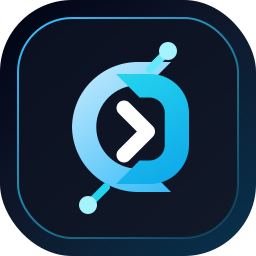
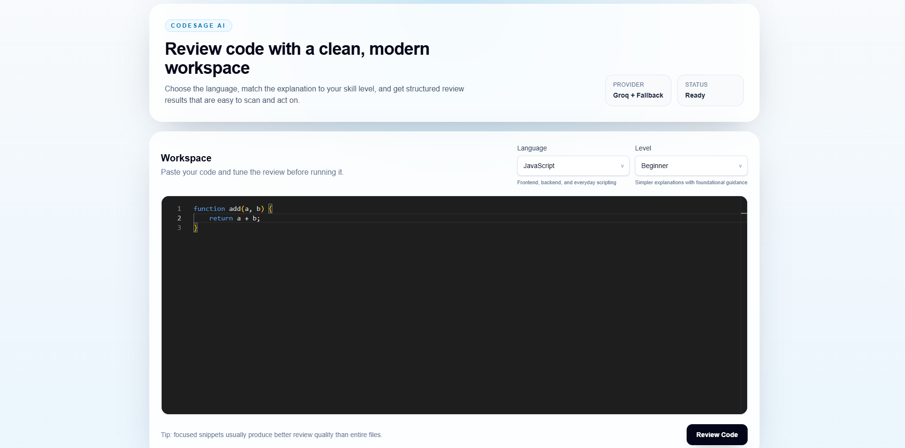

<h1 align="center">CodeSage AI | AI Powered Code Reviewer</h1>

<p align="center">
  
</p>

<p align="center">
  
  
  
  
  
  
</p>

<p align="center">
  <b>Paste code. Get clarity.</b><br />
  Structured reviews, optimized code, and explanation depth that adapts to the developer reading it.
</p>

<p align="center">
  <a href="#overview">Overview</a> |
  <a href="#sneak-peek">Sneak Peek</a> |
  <a href="#why-it-feels-different">Why It Feels Different</a> |
  <a href="#experience-flow">Experience Flow</a> |
  <a href="#quick-start">Quick Start</a> |
  <a href="#project-structure">Project Structure</a>
</p>

---

## Overview

CodeSage AI is a modern code review experience built with Next.js. It is designed for developers who want feedback that is fast, readable, and actionable instead of noisy or vague.

Drop in a snippet, choose your language, pick the explanation level, and CodeSage AI returns:

- a summary of code quality
- detected issues with severity
- improvements worth making
- an optimized version of the submitted code
- a clear explanation matched to the chosen level

> The goal is simple: make code review feel less like a wall of text and more like a guided workspace.

## Sneak Peek

<p align="center">
  <a href="https://codesage-ai-review.vercel.app" target="_blank" rel="noopener noreferrer">
    
  </a>
</p>

## Why It Feels Different

<table>
  <tr>
    <td width="33%">
      <h3>Structured Output</h3>
      <p>The result is organized into clear sections instead of a single messy response block.</p>
    </td>
    <td width="33%">
      <h3>Level-Based Guidance</h3>
      <p>Beginner, intermediate, and advanced modes make the same review readable for different developers.</p>
    </td>
    <td width="33%">
      <h3>Safer Reliability</h3>
      <p>If the AI response is weak or incomplete, the backend repairs it or falls back locally.</p>
    </td>
  </tr>
</table>

## Experience Flow

```text
Landing Page -> Review Workspace -> AI Review -> Repair Pass if Needed -> Clean Result
                                             \
                                              -> Local Fallback if Provider Fails
```

### What users do

1. Open the intro page.
2. Enter the review workspace.
3. Paste a code snippet into the Monaco editor.
4. Select a language and explanation level.
5. Run the review.
6. Inspect issues, improvements, optimized code, and explanation.
7. Copy the optimized code directly from its section.

## Feature Highlights

### Smart Review Layout

- dedicated intro page on `/`
- focused review workspace on `/review`
- organized result cards for quick scanning
- cleaner UI for summary, issues, improvements, and explanation

### Review Engine

- Groq-powered structured code review
- JSON-shaped responses
- explanation completeness checks
- optimized code repair logic for common AI misses
- local fallback review when provider output is unavailable

### Developer Experience

- Monaco editor integration
- language selection
- explanation depth selection
- copy action for optimized code only
- resilient API route for incomplete AI output

## Modes

| Level | Style |
| --- | --- |
| `beginner` | Foundational guidance and simpler explanations |
| `intermediate` | Balanced practical feedback |
| `advanced` | Sharper technical detail and engineering-focused explanation |

## Example Review Shape

```json
{
  "summary": "The function has a runtime bug caused by an undefined variable.",
  "score": 5,
  "issues": [
    {
      "line": 1,
      "message": "Undefined variable 'n'. Expected 'b' but got 'n'.",
      "severity": "high"
    }
  ],
  "improvements": [
    "Fix the incorrect variable reference.",
    "Add simple tests for expected inputs."
  ],
  "optimizedCode": "function add(a, b) {\n  return a + b;\n}",
  "explanation": "The updated function replaces the undefined variable with the intended parameter so the code behaves correctly."
}
```

## Quick Start

### 1. Install dependencies

```bash
npm install
```

### 2. Add environment variables

Create `.env.local` in the project root:

```env
GROQ_API_KEY=your_groq_api_key_here
GROQ_MODEL=llama-3.1-8b-instant
```

### 3. Start the app

```bash
npm run dev
```

Open `http://localhost:3000`.

## Scripts

```bash
npm run dev
npm run build
npm run start
npm run lint
npm run format
```

## Tech Stack

| Layer | Technology |
| --- | --- |
| Framework | Next.js 16 |
| UI | React 19 |
| Language | TypeScript |
| Styling | Tailwind CSS v4 |
| Editor | Monaco Editor |
| Validation | Zod |
| AI Provider | Groq API |

## Project Structure

```text
src/
  app/
    page.tsx
    review/
      page.tsx
    api/
      review/
        route.ts
  components/
    editor/
      CodeEditor.tsx
  lib/
    ai/
      aiClient.ts
      fallbackReview.ts
      promptBuilder.ts
    validators/
      reviewResponse.schema.ts
public/
  CodeSage-AI.png
  codesage-mark.svg
```

## Current Strengths

- polished intro page before entering the tool
- dedicated review workspace
- structured and readable review results
- optimized-code copy action inside the relevant section
- improved repair path for incomplete AI outputs
- local fallback behavior that keeps the app usable

## Notes

- Groq is the current primary provider.
- When the AI response is partial, CodeSage AI attempts to repair weak fields before falling back.
- The fallback layer is designed to protect the UX instead of failing hard.

## License

This project is licensed under the [MIT License](./LICENSE).
